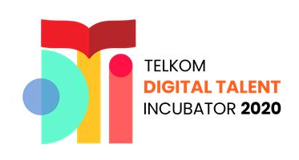

# Digital Talent Incubator
> Source code for DTI, Dimas Samodra-DS0107

 

  

## Task per Week

Please follow this file guide for task per week
- Week 1 : Multiple Regression 17 oct
- Week 2 : Classification 24 oct
- Week 3 : Clustering 31 oct

## Contact Me

Dimas Samodra – [@D_samodraz](https://twitter.com/dbader_org) – dsamodra77@gmail.com

[https://github.com/DSamodra](https://github.com/dbader/)

